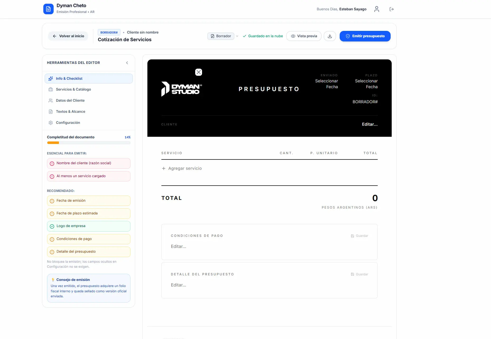
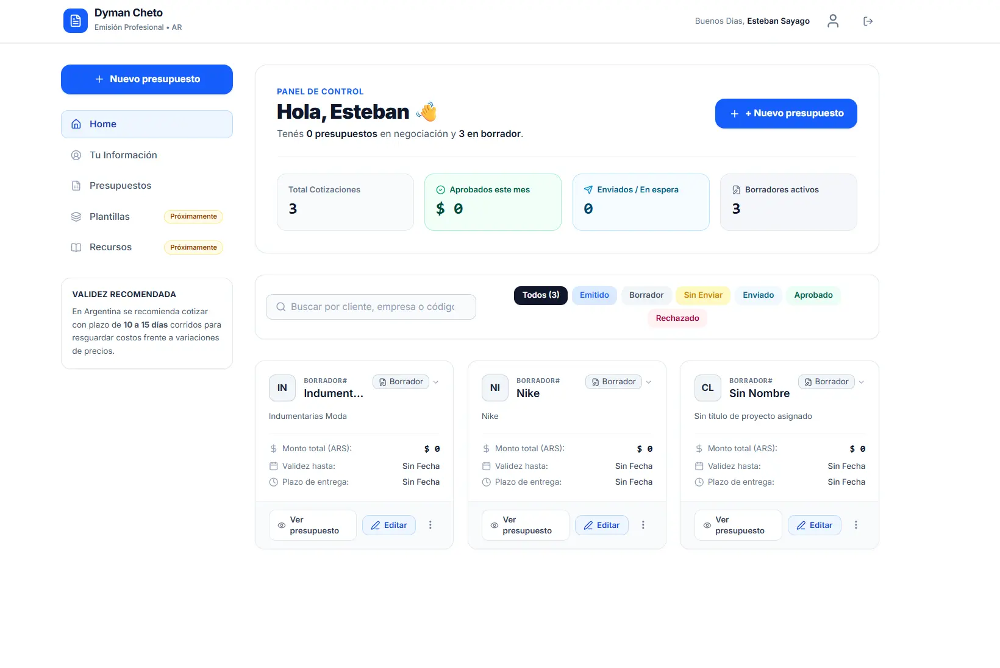
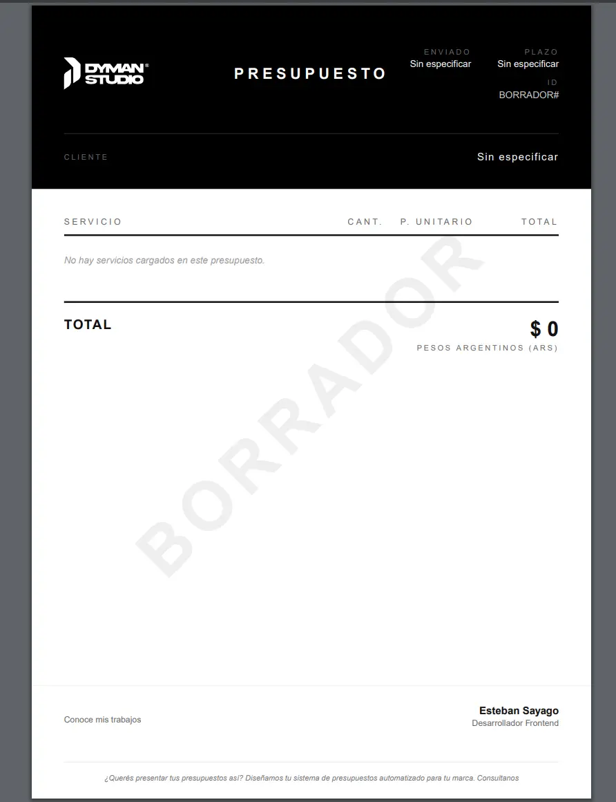
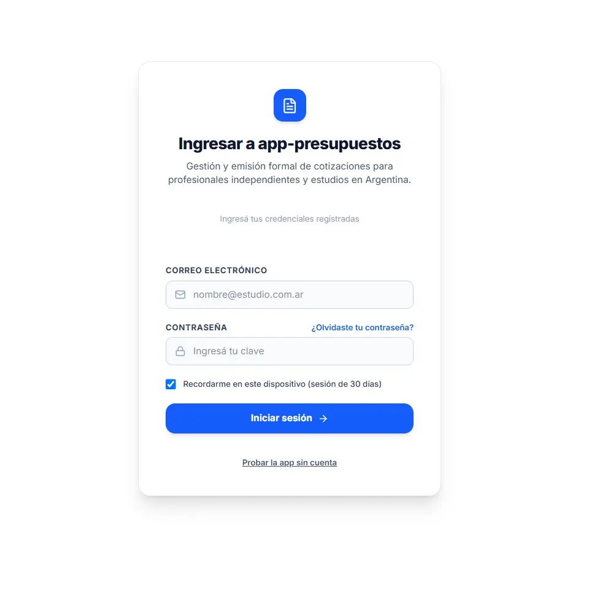

# app-presupuestos

Aplicación web para crear, editar y emitir presupuestos profesionales, pensada para independientes y estudios en Argentina. Los presupuestos se arman en un editor con autoguardado, se exportan a PDF y se emiten con un folio formal.

**Demo en vivo:** https://app-presupuestos-rho.vercel.app
(podés entrar con "Probar la app sin cuenta" desde `/login`; los datos de la demo quedan solo en tu navegador).



## Funcionalidades

- **Autenticación** con Supabase (email y contraseña).
- **Dashboard** con listado de presupuestos, filtros por estado comercial y menú de acciones en cada tarjeta.
- **Editor de presupuestos** con autoguardado (debounce de 800 ms) y un sidebar de cinco pestañas:
  - **Servicios**: catálogo reutilizable de servicios y precios.
  - **Textos**: textos frecuentes y cláusulas.
  - **Configuración**: qué secciones se muestran en el documento (logo, pie, detalles, condiciones).
  - **Cliente**: datos del cliente.
  - **Info**: información general del presupuesto.
- **Exportación a PDF** (vista previa y descarga) con `@react-pdf/renderer`, generado 100% en el navegador.
- **Emisión formal**: confirmación, validación en el servidor y folio automático `PRE-YYYY-NNN`. Un presupuesto emitido pasa a **solo lectura** y no se puede revertir.
- **Perfil de usuario**: nombre, rol, contacto, web, logo e imagen de pie, que se reutilizan en los documentos.
- **Modo demo sin login** (`/demo`): la app completa persistiendo en `localStorage`, sin tocar Supabase.

### Estados de un presupuesto

Cada presupuesto tiene dos estados independientes:

| Campo                     | Valores                                            | Para qué sirve                                                                              |
| ------------------------- | -------------------------------------------------- | ------------------------------------------------------------------------------------------- |
| `status` (fiscal)         | `draft`, `issued`                                  | Si el documento ya fue emitido y quedó bloqueado.                                           |
| `sent_status` (comercial) | `draft`, `pending`, `sent`, `approved`, `rejected` | Seguimiento del presupuesto con el cliente. Se cambia desde el dashboard y desde el editor. |

Al emitir, `status` pasa a `issued` y `sent_status` a `pending`.

## Stack

| Capa               | Tecnología                                             |
| ------------------ | ------------------------------------------------------ |
| Framework          | Next.js 16 (App Router) + React 19                     |
| Lenguaje           | TypeScript                                             |
| Estilos / UI       | Tailwind CSS 4, shadcn/ui, Base UI, lucide-react       |
| Backend            | Supabase (Postgres, Auth, Storage) vía `@supabase/ssr` |
| PDF                | `@react-pdf/renderer`                                  |
| Validación         | Zod                                                    |
| Utilidades         | date-fns, react-day-picker, use-debounce, uuid         |
| Gestor de paquetes | pnpm                                                   |
| Deploy             | Vercel                                                 |

## Puesta en marcha

### Requisitos

- Node.js 20.9 o superior (requisito de Next.js 16)
- pnpm (el repo fija la versión en `packageManager`; con Corepack: `corepack enable`)
- Un proyecto de [Supabase](https://supabase.com) (o Docker, si querés correrlo en local)

### 1. Clonar e instalar

```bash
git clone https://github.com/Puchinn/app-presupuestos.git
cd app-presupuestos
pnpm install
```

### 2. Variables de entorno

Creá un archivo `.env.local` en la raíz:

```dotenv
NEXT_PUBLIC_SUPABASE_URL=https://<tu-proyecto>.supabase.co
NEXT_PUBLIC_SUPABASE_PUBLISHABLE_KEY=<tu-publishable-key>
```

Los dos valores están en tu proyecto de Supabase, en **Project Settings → API**. Son las únicas variables necesarias.

### 3. Conectar un proyecto de Supabase

Las migraciones están en `supabase/migrations/` y crean las tablas, las políticas RLS, el trigger de perfiles y las políticas de Storage.

**Opción A: proyecto en la nube**

```bash
pnpm exec supabase login
pnpm exec supabase link --project-ref <tu-project-ref>
pnpm exec supabase db push
```

**Opción B: Supabase local (requiere Docker)**

```bash
pnpm exec supabase start
```

El comando imprime la URL y la key locales para usar en `.env.local`.

#### Pasos manuales en el panel de Supabase

Hay dos cosas que las migraciones **no** crean:

1. **Bucket de Storage `public_images`.** Las políticas ya están en la migración, pero el bucket hay que crearlo en **Storage → New bucket**. Los archivos se guardan en una carpeta con el `user_id` del usuario (`<user_id>/archivo.png`), y las políticas solo permiten a cada usuario acceder a la suya.
2. **Un usuario para entrar.** La app todavía no tiene pantalla de registro: creá tu usuario en **Authentication → Users → Add user** (con email y contraseña). El trigger `on_auth_user_created` genera su perfil automáticamente.

En **Authentication → URL Configuration**, agregá la URL del sitio (`http://localhost:3000` para desarrollo y tu dominio de Vercel para producción).

### 4. Levantar la app

```bash
pnpm dev
```

Abrí http://localhost:3000.

## Scripts

| Comando      | Descripción                                 |
| ------------ | ------------------------------------------- |
| `pnpm dev`   | Servidor de desarrollo                      |
| `pnpm build` | Build de producción                         |
| `pnpm start` | Servidor de producción (después de `build`) |
| `pnpm lint`  | ESLint                                      |

## Modelo de datos

Arquitectura multi-tenant: todas las tablas tienen `user_id` y usan Row Level Security, así que cada usuario solo ve y modifica sus propios datos.

| Tabla          | Contenido                                                                                                                         |
| -------------- | --------------------------------------------------------------------------------------------------------------------------------- |
| `profiles`     | Datos del usuario (nombre, rol, contacto, logo, imagen de pie) y contadores para el folio. Se crea con un trigger al registrarse. |
| `budgets`      | Presupuestos: servicios, participantes, fechas, textos, configuración de visibilidad y estados.                                   |
| `clients`      | Clientes del usuario.                                                                                                             |
| `services`     | Catálogo de servicios reutilizables.                                                                                              |
| `text_items`   | Textos frecuentes y cláusulas.                                                                                                    |
| `budget_items` | Categorías de ítems.                                                                                                              |

Los servicios y datos de un presupuesto se guardan como **copia** dentro de la fila (`jsonb`), de modo que cambiar el catálogo o el perfil no altera presupuestos ya armados.

## Estructura del proyecto

```
app/
  (auth)/        # /login
  (budget)/      # /new-budget, /edit/[id]
  (dashboard)/   # /, /profile
  demo/          # versión sin login (localStorage)
components/      # componentes de UI compartidos
features/
  budget/        # editor, PDF, acciones
  clients/
  services-catalog/
  text-item/
  user/
  local/         # persistencia local para el modo demo
hooks/
lib/             # clientes de Supabase y utilidades
supabase/
  migrations/    # esquema de la base
proxy.ts         # protección de rutas (auth)
```

## Deploy en Vercel

1. Importá el repositorio en Vercel.
2. Cargá las dos variables de entorno (`NEXT_PUBLIC_SUPABASE_URL` y `NEXT_PUBLIC_SUPABASE_PUBLISHABLE_KEY`).
3. Desplegá. No requiere configuración adicional.
4. Agregá la URL de producción en **Authentication → URL Configuration** de Supabase.

## Capturas

| Dashboard                                     | Editor                                  |
| --------------------------------------------- | --------------------------------------- |
|  |  |

| Vista previa del PDF                      | Login                                 |
| ----------------------------------------- | ------------------------------------- |
|  |  |

## Licencia

Distribuido bajo licencia [MIT](LICENSE). Usalo, modificalo y compartilo libremente.
